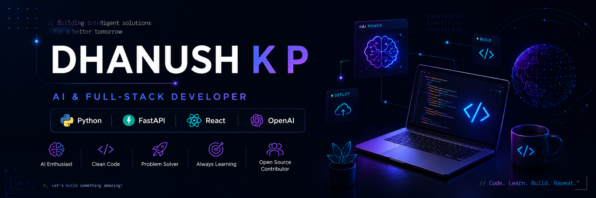

  

<h1 align="center">Hi 👋, I'm Dhanush K P</h1>

<h3 align="center">
Computer Science Engineering Student | AI & Full-Stack Developer | Open Source Learner
</h3>

Passionate about building intelligent applications using AI, Python, FastAPI, React, and modern web technologies.

---

## 🚀 About Me

🎓 Computer Science Engineering Student

💻 Interested in Artificial Intelligence & Full-Stack Development

🌱 Currently learning
- Machine Learning
- System Design
- Cloud Computing
- Docker

🔭 Currently working on
- AI Resume Job Match Scorer
- AI-powered Web Applications

🎯 Goal
- Become a Software Engineer specializing in AI and Backend Development

---

## 🛠 Tech Stack

### Languages

### Frontend

### Backend

### Database

- MySQL
- SQLite

### Tools

Git • GitHub • VS Code • Postman • OpenAI API

---

## 📌 Featured Projects

### 🤖 ResumeBuddy
AI-powered Resume Job Match Scorer with ATS scoring, skill gap analysis, AI suggestions, and interview preparation.

### ❤️ PulseConnect
College Blood Bank Management System for donor registration, blood requests, and event management.

### 📚 More projects coming soon...

---

## 📊 GitHub Stats

---

## 📈 GitHub Streak

---

## 🌐 Connect With Me

---

## 💡 Quote

> "Code. Learn. Build. Repeat."

⭐ Thanks for visiting my profile!
